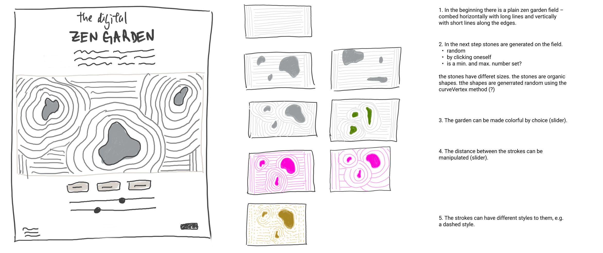
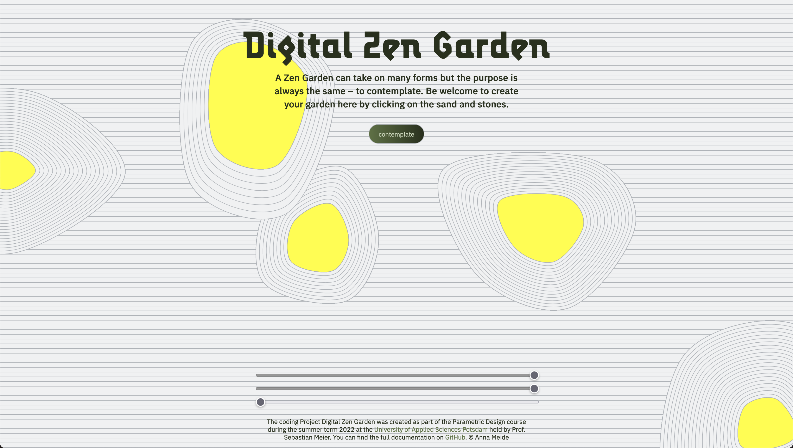
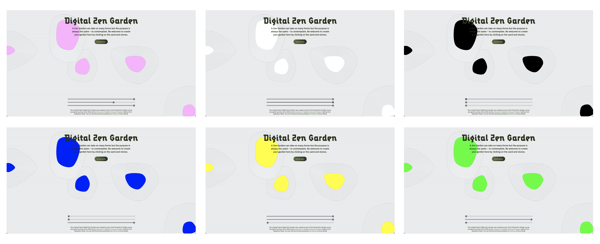

# Digital Zen Garden

## concept
This project was developed as part of the "Parametric Design" course by Prof. Sebastian Meier at the University of Applied Sciences Potsdam. The team work consists of an interactive website where a digital zen garden can be created by clicking on the canvas while contemplatively listening to calm music.

The users are given the opportunity to interactively create their own garden on a screen. The experience allows for a free positioning of five stones, any number of sand lines around each stone and the specification of a favorite stone color. The format is a simple one page website with integrated controls.

## idea sketches

## final version

